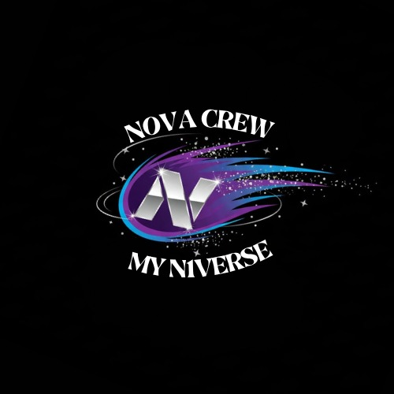

# NOVA CREW MYN1VERSE 🌟

<div align="center">
  
  
  **Sitio web oficial del colectivo de baile K-Pop NOVA CREW MYN1VERSE**
  
  [](https://reactjs.org/)
  [](https://www.typescriptlang.org/)
  [](https://tailwindcss.com/)
  [](https://vitejs.dev/)
</div>

---

## 📖 Sobre el Proyecto

**NOVA CREW MYN1VERSE** es una página web moderna y dinámica diseñada para el colectivo de bailarinas apasionadas por el K-Pop. El sitio captura la esencia vibrante y energética del K-Pop con una estética inspirada en BTS, presentando al grupo, sus integrantes, sub-grupos y su trabajo artístico.

### ✨ Características Principales

- 🎨 **Diseño Moderno**: Interfaz elegante con estética K-Pop, paleta de colores púrpura y rosa, efectos glow y animaciones suaves
- 📱 **Totalmente Responsivo**: Experiencia optimizada para móviles, tablets y escritorio
- 🎭 **Secciones Completas**:
  - **Home**: Presentación impactante con logo animado
  - **Integrantes**: Perfiles detallados de cada miembro con roles y descripciones
  - **Sub-Grupos**: Información sobre Moon y Star
  - **Galería**: Colección de fotos y videos del grupo
  - **Sobre Nosotras**: Historia y misión del colectivo
  - **Contacto**: Formulario funcional y enlaces a redes sociales
- 🔗 **Integración Social**: Links directos a Instagram y TikTok
- ⚡ **Rendimiento Optimizado**: Construido con Vite para carga rápida

## 🛠️ Tecnologías

Este proyecto fue desarrollado utilizando tecnologías web modernas:

| Tecnología | Propósito |
|------------|-----------|
| **React 18** | Librería de interfaz de usuario basada en componentes |
| **TypeScript** | Tipado estático para mayor robustez del código |
| **Tailwind CSS** | Framework CSS utilitario para diseño responsivo |
| **Vite** | Build tool de última generación para desarrollo rápido |
| **Lucide React** | Iconos modernos y minimalistas |
| **Google Fonts (Poppins)** | Tipografía redondeada y amigable |

## 📂 Estructura del Proyecto
```
proyecto-nova-crew/
├── src/
│   ├── components/
│   │   ├── Header.tsx          # Barra de navegación con menú responsivo
│   │   ├── Hero.tsx            # Sección principal con logo y presentación
│   │   ├── Members.tsx         # Tarjetas de integrantes con animaciones
│   │   ├── SubGroups.tsx       # Información de sub-grupos Moon y Star
│   │   ├── Gallery.tsx         # Grid de imágenes y videos
│   │   ├── About.tsx           # Historia y misión del grupo
│   │   ├── Contact.tsx         # Formulario y datos de contacto
│   │   └── Footer.tsx          # Pie de página con redes sociales
│   ├── App.tsx                 # Componente raíz
│   ├── main.tsx                # Punto de entrada de la aplicación
│   └── index.css               # Estilos globales y configuración
├── public/
│   └── NovaCrewLogo.jpeg       # Logo oficial
└── ...archivos de configuración
```

## 🚀 Instalación y Uso

### Requisitos Previos

- Node.js 16.0.0 o superior
- npm (incluido con Node.js)

### Pasos para Ejecutar Localmente

1. **Clonar el repositorio**
```bash
   git clone 
   cd proyecto-nova-crew
```

2. **Instalar dependencias**
```bash
   npm install
```

3. **Iniciar servidor de desarrollo**
```bash
   npm run dev
```

4. **Abrir en el navegador**
```
   http://localhost:5173/
```

### Comandos Disponibles
```bash
npm run dev      # Servidor de desarrollo
npm run build    # Compilar para producción
npm run preview  # Previsualizar build de producción
npm typecheck    # Verificar tipos TypeScript
npm run lint     # Validar código
```

## 🎨 Capturas y Demos

_El sitio presenta una navegación fluida entre secciones, con transiciones suaves y efectos visuales que reflejan la energía del K-Pop._

## 🌐 Redes Sociales de NOVA CREW

- **Instagram**: [@n0va_crew](https://www.instagram.com/n0va_crew)
- **TikTok**: [@nova_crew_myn1ver](https://www.tiktok.com/@nova_crew_myn1ver)

## 📄 Licencia

Este proyecto fue creado para NOVA CREW MYN1VERSE © 2025

## 👨‍💻 Desarrollador

**Desarrollado por Ivan Velasco**

Si te gustó este proyecto o quieres usarlo como referencia, ¡no olvides dar crédito! ⭐

---

<div align="center">
  Hecho con 💜 para NOVA CREW MYN1VERSE
</div>
